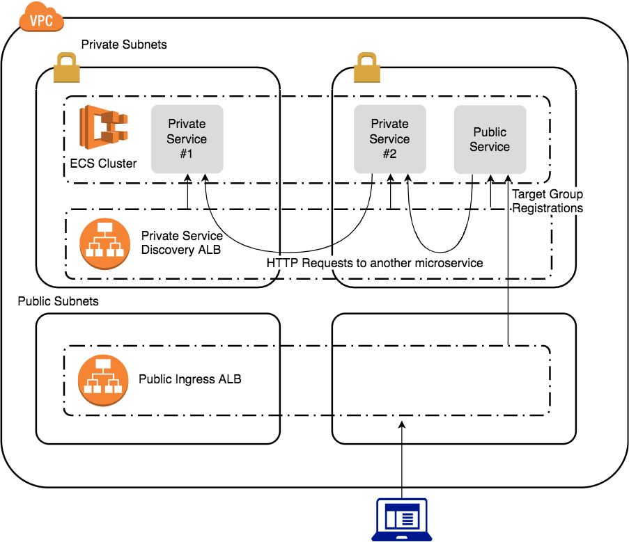

# Dual ALB Public/Private Service Discovery

## Use Case
- Run one or more microservice based applications on an ECS cluster
- Expose the entrypoint proxy/router microservices publicly
- Keep the other microservices private
- Minimal AWS infrastructure

## Security Groups
| Name         | Rule Type | Port/Protocol | Source                     |
| ------------ | --------- | ------------- | -------------------------- |
| External_ALB | Ingress   | HTTPS         | 0.0.0.0/0                  |
| Internal_ALB | Ingress   | HTTP          | ECS                        |
| ECS          | Ingress   | ANY           | External_ALB, Internal_ALB |

## Diagram

Made with [draw.io](https://www.draw.io), XML definition [here](./images/dual_alb_drawio.xml).

## Terraform
Currently this version ([danieladams456/aws-labs](https://github.com/danieladams456/aws-labs/tree/master/dual_alb)) uses an "internal service discovery" security group that is shared between ECS and the internal ALB.  The design here allows for single dedicated security groups for each resource.  I will update it when I get a chance.
