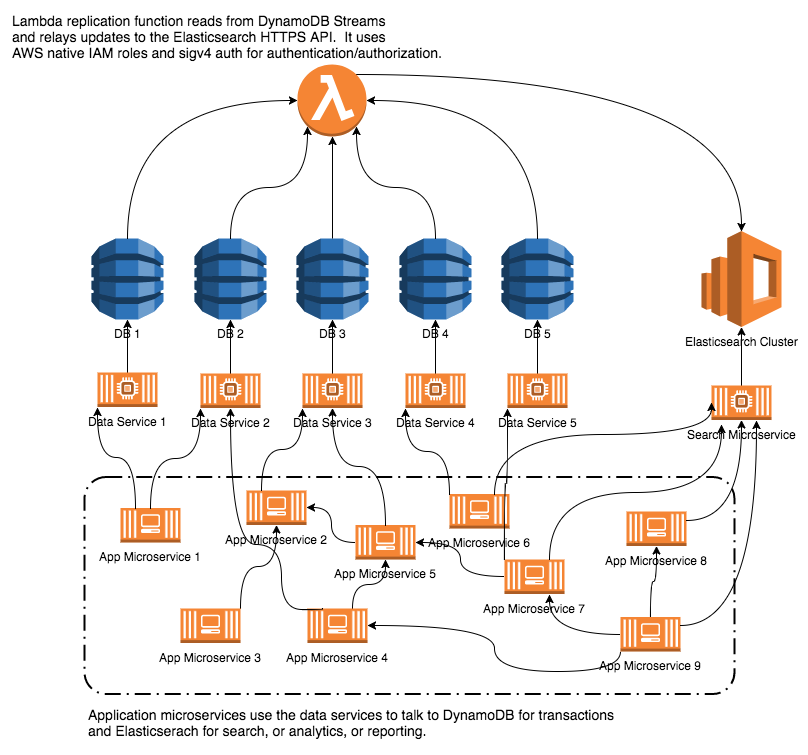

# Using DynamoDB + Elasticsearch for OLTP + OLAP

## Theory
DynamoDB is a scalable, performant, cost-effective, low maintenance database solution.  Too good to be true, right?  As always, there are tradeoffs.  NoSQL and especially DynamoDB have very limited query options and require a thoughtful design up front to work effectively for your application.  DynamoDB is built specifically for transactional workloads (OLTP), but most applications also need some analytics/reports (OLAP) or search capabilities.  Pairing the two database technologies helps get the best of both worlds.

Why not just use relational/RDS/Aurora?  Relational is sort of the middle of the road approach that is pretty flexible and can handle both, but not as efficiently.  To do partial text search over several columns would require chained `LIKE` statements, which is not ideal.  In this case I am proposing a design for a low scale but complex app.  However, DynamoDB and Elasticsearch can both efficiently scale horizontally and thus can be used in web scale applications.

This solution is also more cost effective.  When building a microservices based application, databases should not be shared between microservices to ensure they are not coupled from change management or availability perspectives.  An application with 5 data services, 3 node clusters, and 4 environments requires a total of 60 database servers!  On the other hand, an equivalent app using this pattern would have just 11 servers.  This is because the Elasticsearch is not the transactional system of record and can be regenerated at any time from DynamoDB.  This allows us to share one cluster for the whole application.  It still follows the 1:1 relationship between microservice and DB since it would be fronted by a single search microservice.

This pattern is already in use by other companies like [Fender Digital](https://www.fenderdigital.com).  They talked about it on the AWS blog [Combining DynamoDB and Amazon Elasticsearch with Lambda](https://aws.amazon.com/blogs/startups/combining-dynamodb-and-amazon-elasticsearch-with-lambda).  There is also a workshop at Re:Invent 2018 covering this topic.  My solution expands on this idea to do a generic mapping from many DynamoDB tables to one Elasticsearch cluster, optimized for a microservices architecture application.

## Diagram

Made with [draw.io](https://www.draw.io), XML definition [here](./images/dynamodb_elasticsearch_drawio.xml).

## Replication Code
This code was based on the sample function in the [AWS Elasticsearch Service docs](https://docs.aws.amazon.com/elasticsearch-service/latest/developerguide/es-aws-integrations.html#es-aws-integrations-dynamodb-es).  Here are some of the changes I made to make it more generic.
1. Pull the region from the AWS managed region environment variable, and pass in the elasticsearch endpoint via environment variable managed by Terraform.
2. Create a function to get the type of a DynamoDB item.  This is used to determine in which index to put it in Elasticsearch.  As mentioned below, Elasticsearch 6.x only allows a single type per index.  If the `TYPE` attribute is missing, fall back to `default`.  This is the only attribute that needs to be standardized across the tables.
3. Create a function to generate the Elasticsearch key based off the DynamoDB key[s].  It can handle arbitrary key names and a solo partition key or partition+sort keys.
4. Use the [dynamodb-json](https://pypi.org/project/dynamodb-json) to strip out the type information and transform the DynamoDB item to standard JSON.

*Disclaimer: this code is not production ready.  Use at your own risk*.
```python
import os
import json

import boto3
import requests
from requests_aws4auth import AWS4Auth
from dynamodb_json import json_util as ddb_json

# signature v4 signing properties
region = os.environ.get('AWS_REGION')
service = 'es'
credentials = boto3.Session().get_credentials()
aws_auth = AWS4Auth(credentials.access_key, credentials.secret_key,
                    region, service, session_token=credentials.token)

# elasticsearch request properties
es_endpoint = 'https://' + os.environ.get('ELASTICSEARCH_ENDPOINT')
headers = {'Content-Type': 'application/json'}


def lambda_handler(event, context):
    count = 0
    for record in event['Records']:
        """
        We need the stream type to be NEW_AND_OLD_IMAGES in order to pull
        the item type out of the deleted item's attributes
        """
        if record['eventName'] == 'REMOVE':
            handle_remove_event(record)
        else:
            handle_upsert_event(record)
        count += 1
    print(str(count) + ' records processed.')


def handle_upsert_event(record):
    record_key = get_record_key(record)
    document = ddb_json.loads(record['dynamodb']['NewImage'])
    record_type = get_record_type(document)

    url = '{}/{}/_doc/{}'.format(es_endpoint, record_type, record_key)
    r = requests.put(url, auth=aws_auth, json=document, headers=headers)


def handle_remove_event(record):
    record_key = get_record_key(record)
    document = ddb_json.loads(record['dynamodb']['OldImage'])
    record_type = get_record_type(document)

    url = '{}/{}/_doc/{}'.format(es_endpoint, record_type, record_key)
    r = requests.delete(url, auth=aws_auth)


# Helper methods
def get_record_key(record):
    """
    Get the primary key for use as the Elasticsearch ID by dumping all keys so it works across tables.
    Parse out verbose DynamoDB JSON and don't include any whitespace by using compact separators.
    """
    keys = record['dynamodb']['Keys']
    return json.dumps(ddb_json.loads(keys), separators=(',', ':'))


def get_record_type(document):
    if 'TYPE' in document and type(document['TYPE']) is str:
        return document['TYPE'].lower()
    else:
        return 'default'
```

## Other Replication Notes
If you app is in an enterprise where there are scheduled maintenance windows and can handle a couple minutes of downtime, you can delete all the Elasticsearch indices and reload them from DynamoDB during off hours over the weekend.  This helps ensure over time the DynamoDB tables and Elasticsearch don't drift apart for whatever reason.  I'm sure it could also be done in a blue/green fashion with no downtime using a second Elasticsearch cluster, but that would add more complexity.


## Elasticsearch Sizing - optimize for small data volume since the cluster is scoped to a single application
- Nodes
  - 2 data nodes
    - must be even number for AZ balancing feature
    - AZ balancing ensures replica shards are in different AZs than their respective primary shards.
  - 3 master nodes
    - only needed for production environment
    - 3 nodes ensures quorum even if a node is lost to prevent split brain issues
- Indexes
  - around 10 indexes, i.e. 5 DynamoDB tables and 2 types per table
  - As of ES 6.x [only one type per index](https://www.elastic.co/guide/en/elasticsearch/reference/current/_basic_concepts.html#_type)
- Shards
  - 1-2 shards per index
  - Since we will have a higher number of relatively small indexes, keep shard overhead to a minimum ([docs](https://www.elastic.co/blog/how-many-shards-should-i-have-in-my-elasticsearch-cluster))
  - >Small shards result in small segments, which increases overhead. Aim to keep the average shard size between a few GB and a few tens of GB.
  - >A good rule-of-thumb is to ensure you keep the number of shards per node below 20 to 25 per GB heap it has configured
- Replicas
  - 1 primary + 1 replica shard to distribute data to second node

Example template sets one shard per index and keeps the default of one replica per shard.
```json
{
  "index_patterns": ["*"],
  "settings": {
    "number_of_shards": 1
  }
}
```
